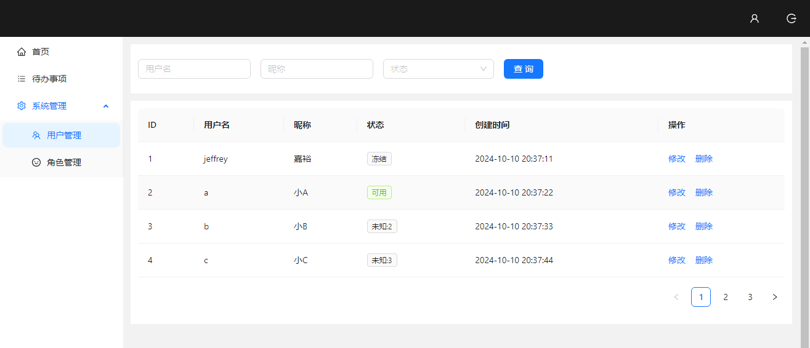

# admin_platform
基于React、Antd的后台管理平台

## 主要练习内容

1. 表格页相关组件及对应hooks实现和开发

**组件**
- BaseTable组件
- Pagination组件
- SearchForm组件

**hooks**
- useTable
- usePagination
- useSearchForm

2. 表单页

**组件**
- BaseForm组件

**hooks**
- useForm
